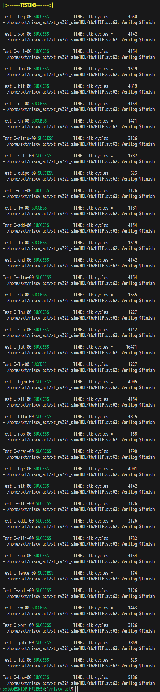

# 架构认证测试(Architectural Certification Tests)

目前只进行了用户级指令的测试：

在对处理器进行具体的完整验证前，可以先快速运行架构认证测试。

架构认证测试用于确认处理器基本结构、基本行为在允许的[ISA规范](https://riscv.org/specifications/ratified/)内，不能代替完整验证测试。通过测试只能说明处理器基本符合RISC-V规范，能正确执行软件。

[官方测试仓库](https://github.com/riscv-non-isa/riscv-arch-test/tree/act4)在此，新的架构认证测试(之前也叫一致性测试)已换用ACT4框架，用于替代已弃用的[RISCOF](https://riscof.readthedocs.io/en/latest/)框架。

## 环境搭建

可以参考[官方文档](https://github.com/riscv/riscv-arch-test/blob/act4/README.md)的**Getting Started**章节，官方文档已经比较详细了。

构建GNU工具链会消耗很长的时间，可能长达2个小时，需要提前做好准备。目前尚不清楚，非官方的构建，是否会对架构认证测试，造成不良影响。

推荐使用Ubuntu虚拟机或者[WSL](https://learn.microsoft.com/zh-cn/windows/wsl/install)作为测试系统环境，这不属于测试内容。

## 测试流程

在测试之前，我们必须弄清下面的概念：

- **Test Suites(测试套件)**: 根据不同ISA子集对测试进行分组，套件主要包含不同指令测试所需的**汇编程序代码**，覆盖点可能因DUT配置而有所差异
- **The test signature(测试签名)**: 每项测试结束后，会把某个内存区域的值保存下来，从而生成一份测试签名，测试过程中处理器**可能**会向这些内存区域写入数据
- **The reference signature(参考签名)**: 由参考模型（RISC-V SAIL）运行测试生成，将测试签名与之进行比较，可以作为测试结果**判决条件之一**
- **Device Under Test(被测设备, DUT)**: 实际进行测试的设备，被用作与参考模型比较，通常是指令集仿真器、HDL仿真器上的RTL模型、或者实现RISC-V的FPGA或物理芯片

测试的流程可以概括为下面几步：

1. ACT4框架根据DUT配置，编译出**签名生成版ELF**
2. 参考模型运行**签名生成版ELF**，得到参考签名
3. ACT4框架再根据参考签名，反过来重新编译出**自检测试版ELF**
4. 我们的DUT运行**自检测试版ELF**，并告知测试主机自己是否通过测试

**自检测试版ELF**要求处理器内核，自我检测出当前测试是否通过。因此，我们要测试的处理器内核必须完整。并且，某一条指令失效，可能会导致所有测试都失败。

### DUT配置

我们需要把自己DUT的特性，比如支持的指令集、实现的功能等，告知给ACT4框架，这样它才能为我们的DUT，生成出合适的测试代码。

[官方文档](https://github.com/riscv/riscv-arch-test?tab=readme-ov-file#configuration)已经写得比较详细了，可以直接参考官方文档的内容。

UDB配置文件中的一些选项，可以到此[查询详细信息](https://riscv.github.io/riscv-unified-db/example_cfg/html/example_rv64_with_overlay/landing.html)。

### 使用HDL仿真器构建DUT

直接在实机上运行测试较为困难，一般我们会使用仿真的方式来完成测试。我们编写的SystemVerilog代码，本质上就是一个RTL模型，可以使用HDL仿真器，仿真运行代码充当DUT。

下面会使用[Verilator](https://verilator.org/guide/latest/)作为仿真器。

Verilator可以将RTL模型编译为一个C++类，我们需要自己编写一个简单主程序(`main()`函数)，即“包装器”来控制模型的输入输出端口，在C++程序中完成仿真。

虽然可以把大量的逻辑，都放到C++包装器中完成，但是这样会非常麻烦，人工用C++软件代码去建模一个硬件的行为，还要处理两种语言的互操作，不是一件轻松的事。

两者性别都不同，怎么谈恋爱啊。

因此，我们直接用SystemVerilog写一个仿真程序更好。这个仿真程序也可以叫测试台，显然，仿真程序是不可综合的。对于架构认证测试，要测试用户级指令，只需要3个东西。一个是处理器内核，另一个是内存，最后一个是HTIF（即主机目标接口）。我们把这三个东西，实例化到测试台模块中，然后向外引出时钟和复位端口，测试台作为顶层模块。

当Verilator把测试台编译为一个C++类后，我们在包装器中，只需要控制时钟信号和复位信号就好了。仿真程序开始运行后，首先把编译好的测试程序加载到内存中，随着时钟的运行，处理器内核自动完成测试，最后使用HTIF通知外界，本次测试已结束。

实际上就是往`tohost`内存地址写入数据。往这个地址写入数据`1`，就代表测试通过，写入`3`，就代表测试失败。这些用于判断的特殊值，可以在DUT配置中修改，一般都不修改。测试结束后，还可以生成签名文件，用于与参考签名对比，实际上就是把内存中`sig_begin_canary`到`sig_end_canary`地址的数据以文本形式保存下来，每4个字节作为一行。不包含两侧端点地址的数据。

`tohost`,`sig_begin_canary`,`sig_end_canary`这三个地址，在测试代码的**汇编符号表**中可以查询到。每项测试都不同，需要通过命令行参数来动态引入。

具体实现可以参考本项目的[测试台代码](xt_rv32i_sim/HDL/tb)和[包装器代码](xt_rv32i_sim/verilator_cpp/sim_main.cpp)。

### 测试启动脚本

官方的ACT4框架，只能帮我们编译出**自检测试版ELF**。而要在我们的DUT上运行测试，只能由我们自己来完成。本项目使用Python，编写了一个[测试启动脚本](run.py)。

脚本中包含了部分仿真参数和路径信息，使用前请根据自身实际情况，做出适当地调整。

脚本总共做了下面这些事：

1. 按照官方的方法，生成并编译**自检测试版ELF**
2. 构建Verilator**仿真可执行程序**（每次运行测试都要重新构建）
3. 把每项测试的ELF转换为hex文本文件，便于仿真程序读取到内存，并提取出符号表等信息
4. 针对每项测试，把必要的命令行参数传入**仿真可执行程序**，并运行仿真
5. 测试进行完成

## 运行测试示例

以本项目的代码为例，运行测试。假设你已经进入到了本文档所在的目录。

首先，你需要根据实际情况修改[测试启动脚本](run.py)中riscv-arch-test仓库路径等信息和仿真参数。

还要把参与测试的SystemVerilog代码(处理器内核)放入`./xt_rv32i_sim/HDL`对应的目录中，或者修改脚本中的`HDL`路径参数

然后执行以下命令来运行架构认证测试（假设你已经根据官方文档安装了Python/uv），这里因为脚本中使用了pyyaml库，所以需要用此命令启动。

`uv run --with pyyaml python run.py`

显示测试结果、签名生成等操作都由仿真程序自行完成，测试启动脚本只负责启动仿真。
