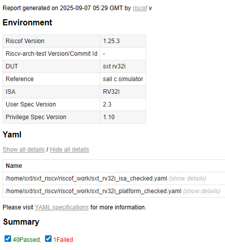
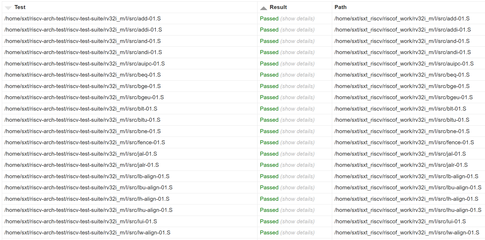
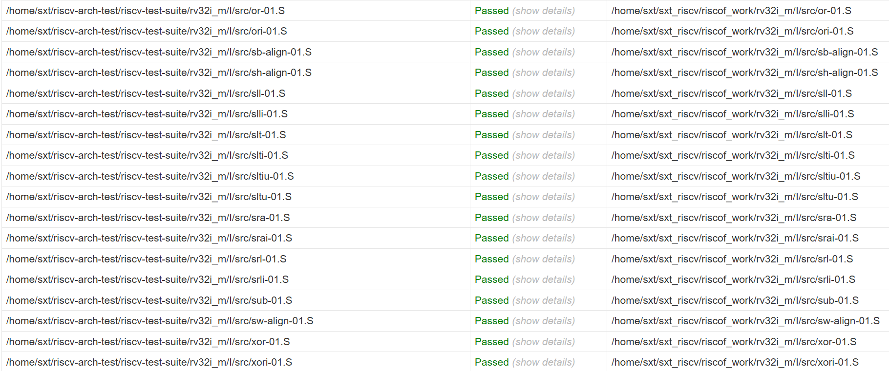

# 一致性测试

**@Deprecated**
**由于官方使用ACT4框架代替了旧的RISCOF框架，此处的内容已不再适用**
**请到[ACT4](../../ACT4)查看最新的架构认证测试代码**

本文档**未完成**！







在对处理器进行具体的完整验证前，可以先快速运行一致性测试。

一致性测试用于确认处理器基本结构、基本行为在允许的[ISA规范](https://riscv.org/specifications/ratified/)内，不等同于完整验证测试。

通过测试只能说明处理器基本符合RISC-V规范，能正确执行软件。

官方[测试仓库](https://github.com/riscv-non-isa/riscv-arch-test)在此

## 环境搭建

可以参考[官方文档]的**Getting Started**章节，下面只是记录官方文档中的一些**坑**并给出解决方案。

### 系统环境

首先准备好一个Ubuntu虚拟机或者[WSL](https://learn.microsoft.com/zh-cn/windows/wsl/install)，这不属于测试内容。

### 安装 Python

在最新的Ubuntu上很有可能已经预装了Python 3.12，否则先安装Python:

```shell
sudo apt update
# 自行调整要安装的Python版本
sudo apt-get install python3.12
sudo apt install python3-pip
sudo apt install python3.12-venv
```

安装完成后请先确认安装成功

```shell
python3 --version
pip3 --version
```

新系统默认对Python包进行了限制，不允许在系统环境中安装或升级 Python 包，以避免破坏系统自带的 Python 配置。

需要创建一个虚拟环境（自行决定创建目录）`python3 -m venv [myenv_path]`

然后可以使用这条指令进入到虚拟环境`source [myenv_path]/bin/activate`，终端前面多了个括号表明进入了虚拟环境，例如：`(myenv) user@host:~$`

最后更新pip`pip3 install --upgrade pip`

之后的所有操作都在**虚拟环境**中进行！！！

### 安装 riscv-ctg 和 riscv-isac

参照[官方文档]即可

### 安装 RISCOF

参照[官方文档]即可

### 安装 RISCV-GNU 工具链

官方文档中会克隆仓库并在本地构建，这将会消耗大量的流量与时间，可以自行寻找预编译的二进制版本进行安装以节约时间，如果不关心，参照[官方文档]即可

可以把命令中的`/path/to/install`替换为其他安装位置`[riscv-gnu-install-path]`，安装完成后**务必**编辑虚拟环境中的启动脚本：`nano [myenv_path]/bin/activate`，在最后加一行`export PATH="[riscv-gnu-install-path]/bin:$PATH"`从而把工具链添加到`$PATH`中

重新进入虚拟环境后可以验证是否安装成功`riscv32-unknown-elf-cpp --version`

**注意**：你完全可以使用其他编辑器，不一定是`nano`

### 安装 RISC-V 参考模型：Spike 和 SAIL

参照[官方文档]即可

命令中的`[sudo]`表示可选项，注意辨别，不要原封不动复制命令

构建 RISC-V Sail时可能需要安装cmake`sudo apt install cmake`

### 必要的环境文件

- **config.ini**:在克隆**riscv-arch-test**仓库时已经安装，位于`riscv-arch-test/riscof-plugins/rv32[64]/`
- **riscv-test-suite/**: 在克隆**riscv-arch-test**仓库时已经安装，位于`riscv-arch-test/riscv-test-suite/`
- **riscv-config/**:**可能**在安装Python包过程中已经安装，但不是最新的。如果已经安装，必须卸载`pip uninstall riscv-config`然后从Github仓库安装最新代码`pip install git+https://github.com/riscv/riscv-config.git`

### 运行测试

```shell
cd riscv-arch-test/riscof-plugins/rv32 #If you want to run the rv64 test, change this to rv64
riscof run --config config.ini --suite ../../riscv-test-suite/ --env ../../riscv-test-suite/env
```

运行完毕会生成一个html文件，打开查看详细。

看完官方文档，我们只是配置好了测试环境，运行了官方模拟器，完全没有教怎么测试自己的处理器。😫关于移植测试的内容官方文档写得比较零散，由几个不同的项目拼接而成，其中还夹杂着一些**过期**内容，让人防不胜防。🤗

## 测试流程

[官方参考文档](https://github.com/riscv-non-isa/riscv-arch-test/blob/dev/doc/README.adoc#The%20architectural%20tests)

在测试之前，我们必须弄清下面的概念：

- **Test Suites(测试套件)**: 根据不同ISA子集对测试进行分组，套件主要包含不同指令测试所需的**汇编程序代码**
- **The test signature(测试签名)**: 每项测试结束后会生成一份签名，测试过程中处理器会向指定的内存区域写入数据，签名就是这些数据的值
- **The reference signature(参考签名)**: 由参考模型（Spike 和 SAIL）运行测试生成，将测试签名与之进行比较，如果完全相同则表明测试通过
- **The test target(测试目标)**: 进行测试的目标，可以是:
- - RISC-V Instruction Set Simulator（指令集仿真器）
- - RISC-V emulator（仿真器）
- - RISC-V RTL model running on an HDL simulator（HDL仿真器上的RTL模型）
- - RISC-V FPGA implementation or a physical chip（实现RISC-V的FPGA或物理芯片）
- **Device Under Test(DUT)(被测设备)**: 实际进行测试的设备，被用作与参考模型比较

因此，我们要做的事情就是构建我们的DUT，然后让DUT运行测试并生成测试签名文件。

### 如何创建新的测试目标并接入我们的DUT？

一致性测试使用基于Python的[RISCOF](https://riscof.readthedocs.io/en/latest/)来完成测试流程

RISCOF通过DUT plugin（DUT插件）来添加新的DUT，因此我们要先给自己的DUT[创建一个DUT插件](https://riscof.readthedocs.io/en/latest/plugins.html#tips)

可以快速在当前目录（最好是空文件夹）创建一个模板`riscof setup --refname=sail_cSim --dutname=[dutname]`自行编辑你的DUT名称，然后当前目录就会多出三个东西：配置文件`config.ini`,参考模型文件夹`sail_cSim`,DUT文件夹`[dutname]`，两个文件夹内分别是两个插件。

#### 适配DUT配置

创建的模板中有许多过期的内容（意料之内），特别是参考模型，建议直接把一致性测试的内置插件中`riscv-arch-test/riscof-plugins/rv32/sail_cSim`参考模型部分复制过来用

然后编辑`[dutname]`里的`\*_isa.yaml`，和`\*_platform.yaml`文件配置，使其符合你的DUT的特性，例如设置地址位宽，实现的指令集之类的。具体请[查看YAML配置规则](https://riscv-config.readthedocs.io/en/stable/)

编辑完成后使用`riscof validateyaml --config config.ini`验证是否有效，这个命令有时候会莫名其妙报错，不知道为什么。

#### 修改Python插件文件

然后需要编辑DUT插件的Python插件文件，测试流程会调用插件文件来执行测试，模板代码中已经帮我们把大部分事情做好了。

插件总共做了3件事：

1. 读取两个YAML配置文件与测试套件
2. 编译构建汇编测试代码，生成ELF
3. 把ELF路径等参数传递给DUT

其中DUT必须是个可执行程序，修改Python插件可以参考本项目的代码。

### HDL仿真器构建DUT

我们编写的SystemVerilog代码本质上就是一个RTL模型，可以使用HDL仿真器仿真运行代码充当DUT。

下面会使用[Verilator](https://verilator.org/guide/latest/)作为仿真器，没有安装的请先安装。

Verilator可以将RTL模型编译为一个C++类，我们需要自己编写一个主程序(main()函数)，即“包装器”来控制模型的输入输出端口，在C++程序中完成仿真，相较于传统的仿真器，Verilator的仿真速度很快。

因为这个特性，Verilator对SV代码的综合部分很友好，而不可综合部分则有限制，代码审查也更加严格。

你可以使用这条指令把SV代码编译为C++，创建makefile文件，然后编译为可执行文件，具体请查阅[文档](https://verilator.org/guide/latest/)

```sh
verilator --top [top_module] -cc [xx0.sv] [xx1.sv] --exe --build [xx0.cpp] [xx1.cpp]
```

#### 仿真程序

仿真程序主要完成以下工作：

1. 把编译好的测试指令加载到内存(RTL模型的内存)中，ELF路径通过插件传入
2. 复位，控制时钟信号等，完成仿真
3. 测试指令会使用一种被称为HTIF的机制与外界交互，从而通知测试结束，实际上就是往`tohost`地址写入1，需要监控这个写入从而结束仿真
4. 在仿真结束或者超时后，进行取证，并生成测试签名文件，实际上就是读取`begin_signature`地址到`end_signature`地址的数据，以**小写16进制文本**形式**小端序**保存每个字的数据，每个字占用一行，签名文件路径通过插件传入

`tohost`,`begin_signature`,`end_signature`这三个地址，在**汇编符号表**中可以查询到，你可以在仿真程序中自行解析符号表，也可以在插件中编译汇编代码时提取符号表然后传入仿真程序。

对于小型的测试，我们可能希望有些代码段从0x00地址开始，因为代码段前通常是全0的无效数据，这样可以节约仿真内存。在插件文件夹中有一个链接器脚本`[dutname]/env/link.ld`，你可以在此修改代码段的起始地址`.text.init`。需要注意的是，测试指令中的写入操作依赖于指令地址偏移量，如果你没有把测试代码加载到起始地址上，而是加载到0x00地址上。写入地址将会与**符号表**中地址不符，而我们的取证使用的是符号表地址，因此`tohost`,`begin_signature`,`end_signature`三个地址都需要减去代码段起始地址，才是实际运行的地址，代码段起始地址通常就是`rvtest_entry_point`，在**符号表**中也可以查询到。

具体的C++程序可以参考本项目代码。

## 运行测试

这里会以本项目的代码为例，运行测试

`cd riscof-plugin/verilator_cpp`

搜索所有sv代码，文件列表放到rtl.files中
`find [search_path] -type f -name "*.sv" -print > rtl.files`

编译SV并构建仿真程序
`verilator --top RISC_V_Core -cc -f rtl.files --exe --build --trace-fst sim_main.cpp sim_mem.cpp utils.cpp htif.cpp -Isrc`

`cd ..`

运行测试，请自行替换riscv-arch-test仓库路径
`riscof run --config config.ini --suite [riscv-arch-test]/riscv-test-suite/ --env [riscv-arch-test]/riscv-test-suite/env/`

[官方文档]:(https://github.com/riscv-non-isa/riscv-arch-test/blob/dev/README.md)
