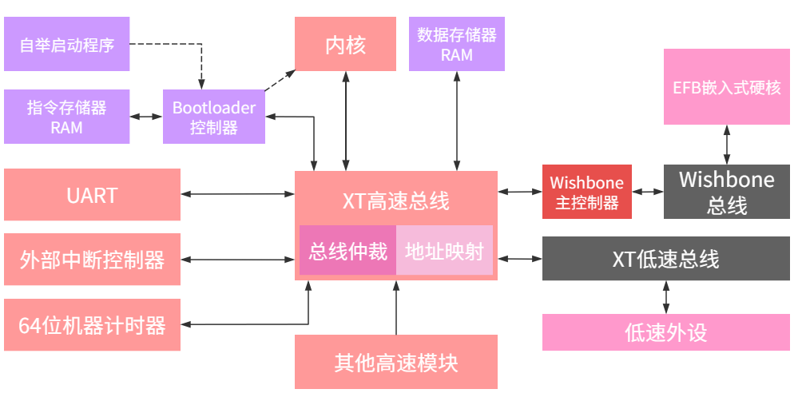

# XT_RISC-V 微控制器

学习笔记

## 异常/中断控制器

提交点：指令执行模块，回写存储器的上升沿。
同步异常：在取指或解码阶段检测到异常后，异常信息会传递给异常控制器流水线，同时仅冲刷下一个流水线模块(杀掉这条指令)。在到达提交点时，由于已经杀掉这条指令，并不会产生什么副作用，异常控制器进入异常处理跳转。
异步异常（中断）：在提交点检测到异步异常时，不能马上进入异常处理跳转，需要等待流水线先执行完成该条指令，在下一个提交点进入异常处理跳转。所以要在 **有效中断请求（启用中断且有中断请求）** 时冲刷流水线，防止下一条指令被执行，还要冲刷异常控制器流水线防止被异常抢占。

一般情况下两种异常都是使用提交点的pc作为mepc的新值，mepc指向的指令都没有被执行。
但是如果异常发生时流水线正在执行跳转操作，mepc应该设置为pc跳转地址：对于同步异常因为流水线已冲刷，实际上异常可能不存在了；对于中断则需要处理。

## RVC32变长指令读取问题

取指令模块执行非4字节对齐访问时，把地址向上对齐到4字节，有数据缓存进行指令合成。

由时序图可以得到几个非常重要的结论：

1. 当指令输出为RVC指令时，PC的值始终选择PC+2缓存。
2. 解压方式来回切换，缓存解压总是后两个字节，普通解压总是前两个字节。
3. 当RVC指令已经出现偶数个时，长指令为直出，短指令为普通解压。
4. 当RVC指令已经出现偶数个时，opcode在前两个字节，否则在后两个字节。

但是这只是顺序读取的情况，如果发生跳转呢，怎么办？
如果跳转到非对齐地址，如何读取指令？
**放弃这个方案**，本质是内存非对齐访问的问题不应该在取指令模块下功夫。

