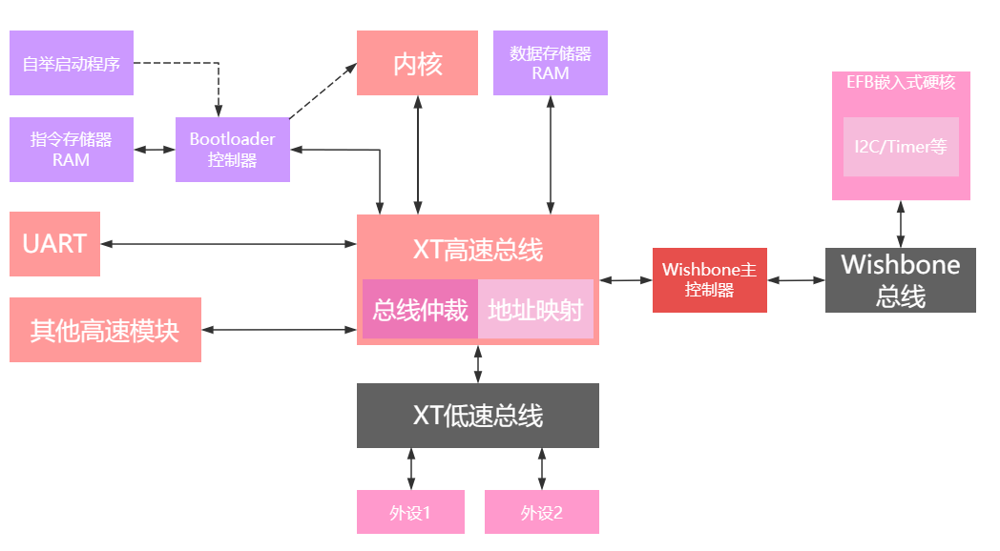
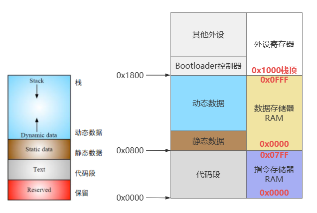
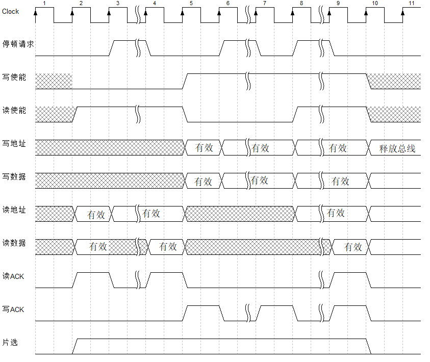
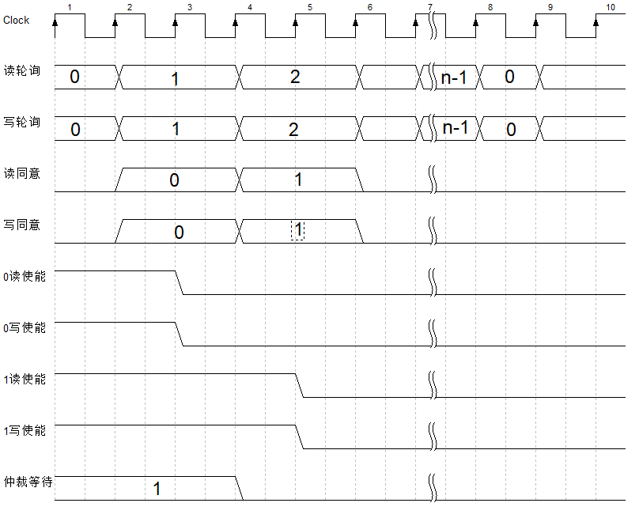
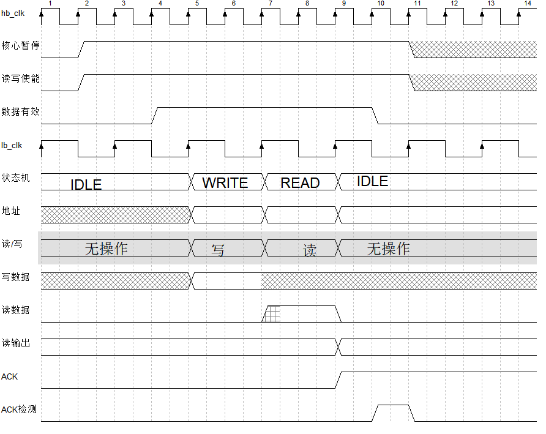
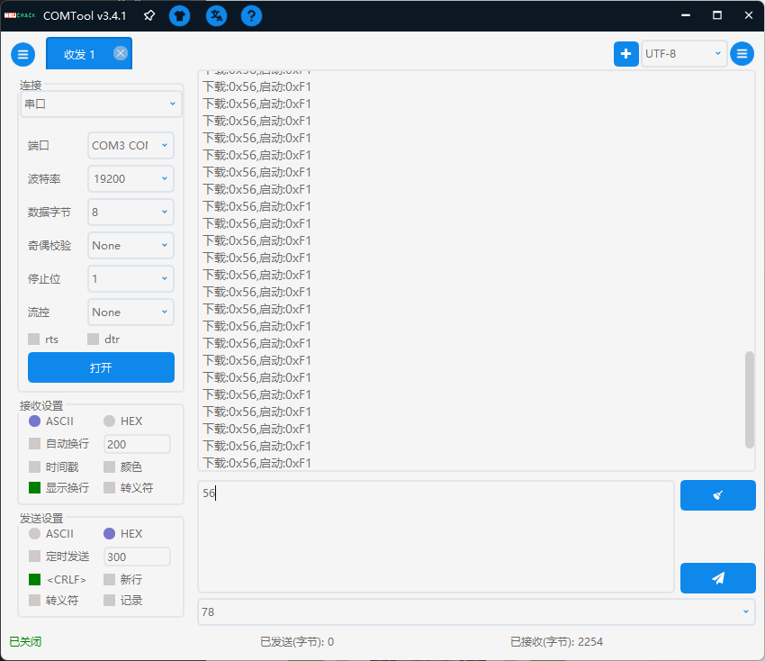
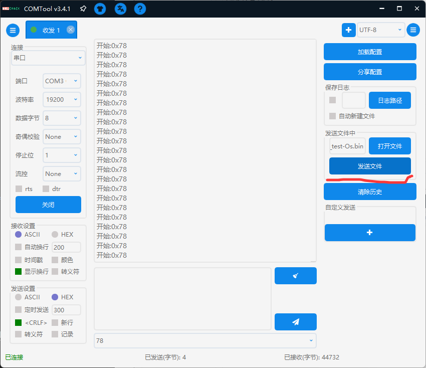
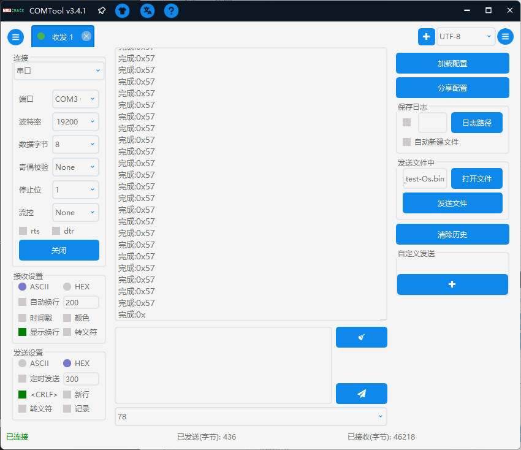
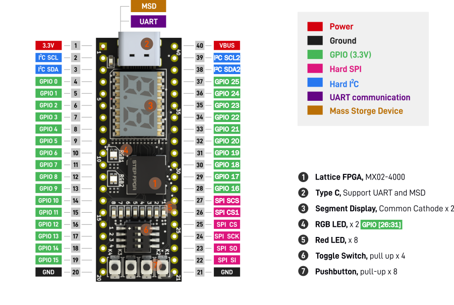

# XT_RISC-V 微控制器

**个人学习作品**，适合初学者食用。

一个极其简易的`RV32I`指令集**单核MCU**，几乎所有用户级与特权级指令支持，仅运行机器模式。

1. [RTL](RTL)包含了所有Verilog代码，顶层文件在[这里](RTL\SOC\XT_Soc_Risc_V.sv)
2. [C_lib](C_lib)包含了本MCU的C语言库文件，包括寄存器定义、启动文件等
3. [Tools](Tools)有c语言编译工具，编译脚本
4. [Tests](tests)包含了测试用的C语言代码，同时也是编译脚本默认寻找**源文件**的位置

PLL等IP核适用于**LCMXO2-4000HC-4MG132C**FPGA器件，IP核仅包含`ipx`和`lpc`文件，请使用开发工具重新生成`verilog`文件。外设基本是围绕[该核心板](https://www.latticesemi.com/zh-CN/Products/DevelopmentBoardsAndKits/STEPMXO2Dev.aspx)设计的，但是处理器内核可以很方便移植到其他FPGA上。

## 目录

- [XT\_RISC-V 微控制器](#xt_risc-v-微控制器)
  - [目录](#目录)
  - [MCU特性](#mcu特性)
    - [RV32I内核](#rv32i内核)
      - [异常/中断控制器](#异常中断控制器)
    - [时钟树](#时钟树)
    - [其他核心模块](#其他核心模块)
      - [外部中断控制器](#外部中断控制器)
      - [MTime和Mtimecmp(机器计时器)](#mtime和mtimecmp机器计时器)
  - [XT高速总线](#xt高速总线)
    - [地址映射](#地址映射)
    - [内核等待机制](#内核等待机制)
    - [读的副效应问题](#读的副效应问题)
  - [XT低速总线](#xt低速总线)
  - [BOOTLOADER](#bootloader)
    - [编译工具链](#编译工具链)
    - [程序下载](#程序下载)
  - [引脚与GPIO](#引脚与gpio)
  - [TODO\_LIST](#todo_list)

## MCU特性

架构图

内存地址映射

### RV32I内核

- 三级流水线，取指、译码、执行
- 不支持JTAG和DEBUG
- 屏障指令空实现(等效NOP)
- ECALL、EBREAK指令跳转异常
- WFI指令暂停流水线

#### 异常/中断控制器

- 不支持中断嵌套
- 不支持软件中断(因为是单核)

### 时钟树

时钟频率可根据实际情况修改。

- 内部振荡器频率**2.15MHz**，作为时钟监视器的独立时钟源
- 时钟监视器监控PLL状态，若出现脱锁将自动重置PLL并发出全局`RST`信号
- 时钟监视器可设置上电等待时间、PLL锁定等待时间，拥有一个外部重置源，通过按钮可重置系统
- PLL输入时钟频率**12MHz**
- 核心、高速总线、WISHBONE总线位于同一时钟域，基准频率**12MHz**
- 机器计时器固定频率**1MHz**
- UART采样频率**153.846KHz**，超采样率为**8**时**波特率19200误差0.16%**
- 低速总线频率**100KHz**

### 其他核心模块

#### 外部中断控制器

- 支持最多32条外部中断
- 中断具有优先级，0号中断优先级最高
- 不直接处理中断清零，通过读写外设寄存器清零

#### MTime和Mtimecmp(机器计时器)

- 无跨时钟域时序惩罚
- 硬件不处理非原子读取一致性问题，通过软件处理

## XT高速总线

XT_HB是内核访问外部数据必经的通道，承担地址映射、互联其他总线的职责。

- 从总线扇出的部分通常只有一条数据，然后输出到多个模块。
- 主设备每次访问称为访问帧，访问帧有三种模式：RO，WO，RW(同时读写)，访问帧过程中信号必须保持稳定，访问帧不可分割，必须等待该访问帧结束才能进入下一访问帧。
- 如果对同一个从设备同时读写，从设备自行决定读取旧数据还是通过旁路读取写入数据。(通常是读取旧数据)
- 读与写独立，如果两个主设备读写不冲突，可以同时进行，读写使能信号本身就是总线请求信号。

主机可以在每帧结束后停止总线访问、切换读写模式。

读写仲裁是独立的，当两个主机已经分别独占了读写资源时，如果同时请求对方的读写资源，这会产生死锁，将重置读写轮询索引到0，保证下次将读写资源仲裁给同一个主机。

### 地址映射

地址映射由分割线实现，分割线将地址空间划分为多个**地址域**，从0开始切分区域，区域结束不包含分割线地址，XT_HB只与各个抽象的**地址域**进行数据交换，**地址域**内部自行控制从设备。

传输到**地址域**的地址信息都被映射到从0起始。

### 内核等待机制

在EX阶段访存需要流水线停顿。如果访问其他总线**地址域**，则停顿周期会更长。XT_HB接收其他**地址域**的finish信号，**地址域**一帧只需要发送一次finish。

### 读的副效应问题

由于读使能作用多个周期，可能对读的副效应产生影响，当从设备的ACK响应之后，才完成一次读写，此时副效应应该只发生一次，从设备自行处理。

在XT_HB本地域中的外设，因为时序要求严格，在读地址有效的下一个周期必须输出数据，本地域控制器会在数据有效周期主动拉低读使能。

## XT低速总线

使用最简单的设计，半双工通信。若读写同时发生，先写后读。
有2个控制信号量：读取，写入。总线保证控制信号一定互斥。

使用时钟域跨越的设计

从机必须在读使能时读取数据，并保证在下一个时钟沿到来前保持稳定，从机读取时不经过输出寄存器。
从机在非读取时（读取为0时）必须输出全0数据，总线通过对所有从机的读数据进行或运算得到总体读数据（不使用MUX的结构）。
总线状态机在锁存状态时锁定总体读数据然后反馈给高速总线。

## BOOTLOADER

自举加载流程：

1. 初始化加载ROM中的Bootloader程序
2. 把FLASH中的数据逐个拷贝到指令存储器RAM中
3. 指令地址跳转到0
4. 触发脉冲将MUX切换到指令存储器RAM

### 编译工具链

[SiFive riscv64-unknown-elf-gcc-8.3.0](https://github.com/sifive/freedom-tools/releases/tag/v2020.04.0-Toolchain.Only)已停止更新但**程序尺寸最小**，自举启动由此编译

[riscv-none-elf-gcc-xpack](https://github.com/xpack-dev-tools/riscv-none-elf-gcc-xpack)标准最新，默认情况下**推荐使用**

### 程序下载

`1页 == 16字节`
`1 page == 16 byte`

最大页数由Flash决定，当前器件为767

综合前请使用[初始化文件](RTL/mem_files)重新生成`rom_boot`与`rom_str`IP核

1. 将下载开关(拨码开关1)拨动到高电平位置
2. 连接电脑并打开串口程序
3. 选择下载操作；**操作提示：*下载:0x56,启动:0xF1***
4. 发送程序的页数(共两字节，先高位)；**操作提示：*Len=***
5. 确认开始下载；**操作提示：*开始:0x78***
6. 发送程序二进制文件（确保已经补零对齐到页长度）
7. 确认下载完成；**操作提示：*完成:0x57***
8. 启动程序；**操作提示：*下载:0x56,启动:0xF1***

## 引脚与GPIO

引脚图来源于[该核心板](https://www.latticesemi.com/zh-CN/Products/DevelopmentBoardsAndKits/STEPMXO2Dev.aspx)

每个功能可以选中某一个GPIO进行功能复用

| GPIO        | 输入复用功能          | 输出复用功能       |
| ----------- | --------------------- | ------------------ |
| GPIO[7:0]   | 定时器重置/定时器输入 | -                  |
| GPIO[28:21] | -                     | SPI CS2/定时器输出 |
| 其他        | -                     | -                  |

## TODO_LIST

- [ ] 其他异常处理函数
- [x] 修改XT_HB的时序，适配单周期原子读写的外设
- [ ] DMA控制器
- [ ] 尝试实现RV32C混合执行，把RV32C解码成RV32I指令
- [ ] 调试器支持
- [ ] FreeRTOS支持
- [ ] Rust重写外设标准库
- [ ] 跑分(低端设备没必要吧)
