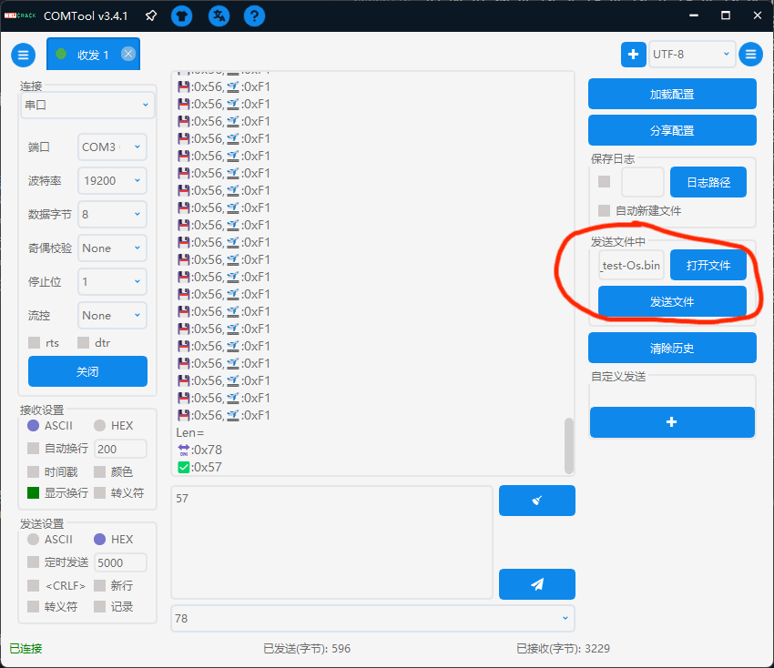

# XT_RISC-V 微控制器

**个人学习作品**，适合初学者食用。

一个极其简易的`RV32I_Zicsr_Sdext`指令集**单核MCU**，所有用户级与特权级指令支持，仅运行在机器模式或外部调试模式。

1. [RTL](RTL)包含了所有Verilog代码，顶层文件在[这里](RTL\SOC\XT_Soc_Risc_V.sv)
2. [firmware_lib](firmware_lib)包含了本MCU的固件库，有[C版本](firmware_lib/c)和[Rust版本](firmware_lib/rust)
3. `rust_release/debug`是rust程序默认的构建输出位置
4. [demo](c_demo)是C语言的示例程序代码，同时也是C程序构建脚本默认寻找**主程序源文件**的位置
5. [ACT4](ACT4)包含了架构认证测试相关的内容(最新的ACT4框架)

[RISC-V架构认证测试(ACT4框架)](ACT4/Readme.md)

PLL等IP核适用于**LCMXO2-4000HC-4MG132C**FPGA器件，IP核仅包含`ipx`和`lpc`文件，请使用开发工具重新生成`verilog`文件。外设基本是围绕[该核心板](https://www.latticesemi.com/zh-CN/Products/DevelopmentBoardsAndKits/STEPMXO2Dev.aspx)设计的，但是处理器内核可以很方便移植到其他FPGA上。

## 目录

- [XT\_RISC-V 微控制器](#xt_risc-v-微控制器)
  - [目录](#目录)
  - [MCU特性](#mcu特性)
    - [RV32I\_Zicsr\_Sdext内核](#rv32i_zicsr_sdext内核)
      - [异常/中断控制器](#异常中断控制器)
      - [调试模块](#调试模块)
    - [时钟树](#时钟树)
    - [其他核心模块](#其他核心模块)
      - [外部中断控制器](#外部中断控制器)
      - [MTime和Mtimecmp(机器计时器)](#mtime和mtimecmp机器计时器)
  - [外设列表](#外设列表)
    - [挂载于XT\_HB32总线](#挂载于xt_hb32总线)
    - [挂载于XT\_LB总线](#挂载于xt_lb总线)
    - [挂载于WISHBONE总线](#挂载于wishbone总线)
  - [XT高速总线](#xt高速总线)
    - [地址分配与MMIO](#地址分配与mmio)
    - [等待机制](#等待机制)
  - [XT低速总线](#xt低速总线)
  - [BOOTSTRAP](#bootstrap)
    - [编译工具链](#编译工具链)
    - [程序下载](#程序下载)
  - [引脚与GPIO](#引脚与gpio)
  - [TODO\_LIST](#todo_list)

## MCU特性

### RV32I_Zicsr_Sdext内核

- 三级流水线：取指、译码、执行
- FENCE指令空实现(等效NOP)
- ECALL指令跳转异常
- WFI指令暂停流水线
- 精简的CSR寄存器([详见RTL代码](RTL/RISC-V/Core/CSR.sv))
- 支持外部调试(最小 RISC-V 调试规范)
- 调试模式时始终禁用中断

#### 异常/中断控制器

- 支持标准中断：定时器中断、软件中断、外部中断
- 所有外部中断，由自定义的外部中断控制器进行重定向，完成中断向量跳转
- 不支持中断嵌套

#### 调试模块

- 最小 RISC-V 调试规范
- Jtag调试传输模块
- 支持查询与控制内核运行状态(停止/恢复)
- 在内核停止时可执行**访问寄存器抽象命令**，可访问所有允许软件访问的寄存器
- 允许复位MCU上的所有非调试逻辑

### 时钟树

时钟频率可根据实际情况修改。

- 内部振荡器频率**2.15MHz**，作为时钟监视器的独立时钟源
- 时钟监视器监控PLL状态，若出现脱锁将自动重置PLL并发出全局`RST`信号
- 时钟监视器可设置上电等待时间、PLL锁定等待时间，拥有一个外部重置源，通过按钮可重置系统
- PLL输入时钟频率**12MHz**
- 核心、高速总线、WISHBONE总线位于同一时钟域，基准频率**12MHz**
- 机器计时器固定频率**1MHz**
- UART采样频率**153.846KHz**，过采样率为**8**时**波特率19200误差0.16%**
- 低速总线频率**100KHz**

### 其他核心模块

#### 外部中断控制器

- 支持最多32条**电平敏感型**外部中断
- 无优先级配置，但中断号越低越优先，0号**外部**中断先于其他**外部**中断触发
- 不直接处理中断清零，通过读写外设寄存器清零

#### MTime和Mtimecmp(机器计时器)

- 无跨时钟域时序惩罚
- 硬件不处理非原子读取一致性问题，通过软件处理

## 外设列表

### 挂载于XT_HB32总线

1. 自举控制器
2. 外部中断控制器
3. 64bit机器计时器
4. UART通信接口
5. 软件中断寄存器
6. 复用GPIO

### 挂载于XT_LB总线

1. 开关(3)与按钮(4)
2. 8位LED灯
3. 硬件解码7段LED数码管X2

### 挂载于WISHBONE总线

该总线的外设为EFB硬核

1. 左PLL动态配置 **TODO**
2. 右PLL动态配置 **TODO**
3. 1号I2C接口
4. 2号I2C接口
5. SPI接口
6. 16bit定时器/计数器
7. 程序存储Flash

## XT高速总线

XT_HB是内核访问外部数据必经的通道，承担内存地址映射、互联其他总线的职责。

- 主设备通过直接访存接口来访问总线
- 主设备还可以通过响应接口查询响应信息：仲裁准予、读写停顿请求等
- 从设备也通过接口连接总线
- 读与写独立，如果两个主设备读写不冲突，可以同时进行，读写启用信号本身就是总线请求信号
- 如果对同一个从设备同时读写，从设备自行决定读取旧数据还是通过旁路读取写入数据。(通常是读取旧数据)

仲裁器使用轮询仲裁器，读写仲裁是独立的。

### 地址分配与MMIO

一个完整访问地址由两部分组成：高位的设备**识别符**，低位的**偏移量**。识别符占用位数是参数配置的，决定了最多能区分多少设备。偏移量占用位数构成固定大小寻址空间。

每个设备至少占用一个识别符，可以**连续**占用多个，占用的第一个识别符是**基准识别符**。**基准识别符**与全0偏移量拼接为设备的**基地址**，**基地址**必须在识别符上对齐。

- 如果设备只占用一个识别符，可以直接使用偏移量作为访问地址。
- 如果设备**连续**占用多个识别符，偏移量寻址空间不足，使用完整地址的**识别符**部分减去**基准识别符**，再与偏移量拼接得到访问地址。

完整地址示例：

| 设备识别符 | 偏移量        | 说明            |
| ---------: | ------------- | --------------- |
|        001 | 0000000000000 | 基地址/访问地址 |
|        101 | 0000000000000 | 基地址/访问地址 |
|        101 | 0000011100001 | 访问地址        |

设备也可以是其他总线，XT_HB只与各个抽象的设备进行数据交换，其他总线内部自行控制从设备。

为避免浪费过多的XT_HB识别符，将大多数高速外设挂载到32bit对齐总线上。对齐总线本身只占用一个识别符，上面的外设寄存器地址都是字对齐(32bit对齐)的。在32bit对齐总线内部，也使用识别符加偏移量的方式来分配地址，但每个设备只能占用一个识别符。

对齐总线对时序要求严格，在上面的设备，必须能够在一个周期完成写入，在读地址有效的下一个周期必须输出数据。

### 等待机制

总线提供了一个访问等待机制，从设备激活`finish`信号来告知此次访问已完成，如果从设备支持无等待访问，可以把`finish`硬连线到激活状态。

当主设备未被仲裁准予，或者访问未完成时，总线向主设备激活读写停顿请求`stall`，读写停顿也是独立的。当主设备收到`finish`后，如果不再对总线进行访问，它必须立刻响应此次`finish`，并撤销对应的读写请求，避免重复读写导致的副效应。从设备的读写副效应，只应该在激活`finish`信号时发生一次。

CPU内核在EX阶段访存需要流水线停顿，如果访问其他总线，则停顿周期会更长，XT_HB接收其他总线的finish信号。

## XT低速总线

XT_HB通过[CDC_MCP_Formulation模块](RTL/Utils/Clock/CDC_MCP_Formulation.sv)跨时钟域，与XT_LB交换数据。

同样使用识别符+偏移量的地址分配策略，每个从设备**平分**地址空间，从设备只进行部分地址解码。

使用最简单的设计，半双工通信。若读写同时发生，先读后写。总线只输出部分地址。从机的读数据输出始终使用组合逻辑读取，不经过输出寄存器。总线内部根据识别符产生写片选独热码，分别路由到不同的从机，固定使用一个周期完成写入。

## BOOTSTRAP

自举加载流程：

1. 初始化加载ROM中的bootstrap程序
2. 把FLASH中的数据逐个拷贝到指令存储器RAM中
3. 指令地址跳转到0
4. 触发脉冲将MUX切换到指令存储器RAM

### 编译工具链

[SiFive riscv64-unknown-elf-gcc-8.3.0](https://github.com/sifive/freedom-tools/releases/tag/v2020.04.0-Toolchain.Only)已停止更新但**程序尺寸最小**~~，自举程序由此编译~~

[riscv-none-elf-gcc-xpack](https://github.com/xpack-dev-tools/riscv-none-elf-gcc-xpack)标准最新，默认情况下**推荐使用**

rust需要安装`riscv32i-unknown-none-elf`编译目标，同时为了在rust中使用异常处理函数，请选择`nightly`版本。

### 程序下载

`1页 == 16字节`
`1 page == 16 byte`

最大页数由Flash决定，当前器件为767

综合前请使用[自举程序](firmware_lib/asm_bootstrap)和[字符串文件](RTL/mem_files/preload_emoji.txt)重新生成`rom_boot`与`rom_str`IP核

emoji提示`💾下载 🛫启动 🔛开始 ✅完成 ❌错误`

1. 将下载开关(拨码开关1)拨动到高电平位置
2. 连接电脑并打开串口程序
3. 选择下载操作；**操作提示：*💾:0x56,🛫:0xF1***
4. 发送程序的页数(共两字节，先高位)；**操作提示：*Len=***
5. 确认开始下载；**操作提示：*🔛:0x78***
6. 发送程序二进制文件（确保已经补零对齐到页长度）
7. 确认下载完成；**操作提示：*✅:0x57***
8. 启动程序；**操作提示：*💾:0x56,🛫:0xF1***

## 引脚与GPIO

引脚图来源于[该核心板的参考资料](https://www.latticesemi.com/zh-CN/Products/DevelopmentBoardsAndKits/STEPMXO2Dev.aspx)

每个GPIO可以从四个复用功能中，选中某一个复用功能进行复用，允许多个引脚复用相同的功能

当多个端口使用相同的输入功能时，得到的结果为**它们的逻辑或**。当多个端口使用相同的输出功能时，复用功能将**在多个端口输出**

功能前有"~"的表示低电平有效

## TODO_LIST

- [x] 其他异常处理函数
- [x] 修改XT_HB的时序，适配单周期原子读写的外设
- [x] ~~用一个小型控制器来加载Flash，而不是ROM，ROM太占用资源了~~ 已通过高度优化自举程序解决
- [x] ~~系统外设整合到一个模块中~~
- [x] 为对齐的寄存器划分单独的地址空间，更加节省资源
- [ ] DMA控制器
- [ ] 尝试实现RV32C混合执行，把RV32C解码成RV32I指令
- [x] Rust重写外设固件库
- [ ] 平台级中断控制器PLIC(考虑到资源消耗，可能性不大)
- [x] 调试器支持
- [ ] ~~FreeRTOS支持~~ 不再考虑FreeRTOS，未来将支持Rust异步运行时(Embassy框架)
- [ ] 跑分(低端设备没必要吧)

---

- [ ] 这综合器真是死了棍木了，参数无默认值有警告，写了= '{default: 0}默认值又变成类型不匹配警告（实际上是匹配的），直接改成字面量传入又没有警告了
- [ ] 害，这个核心板的下载程序有问题，EBR和UFM都无法初始化，JTAG被绑定到中介下载芯片上了，也无法使用逻辑分析仪等工具，唯一的下载方式就是使用模拟的USB大容量设备，并且只支持jed文件。
