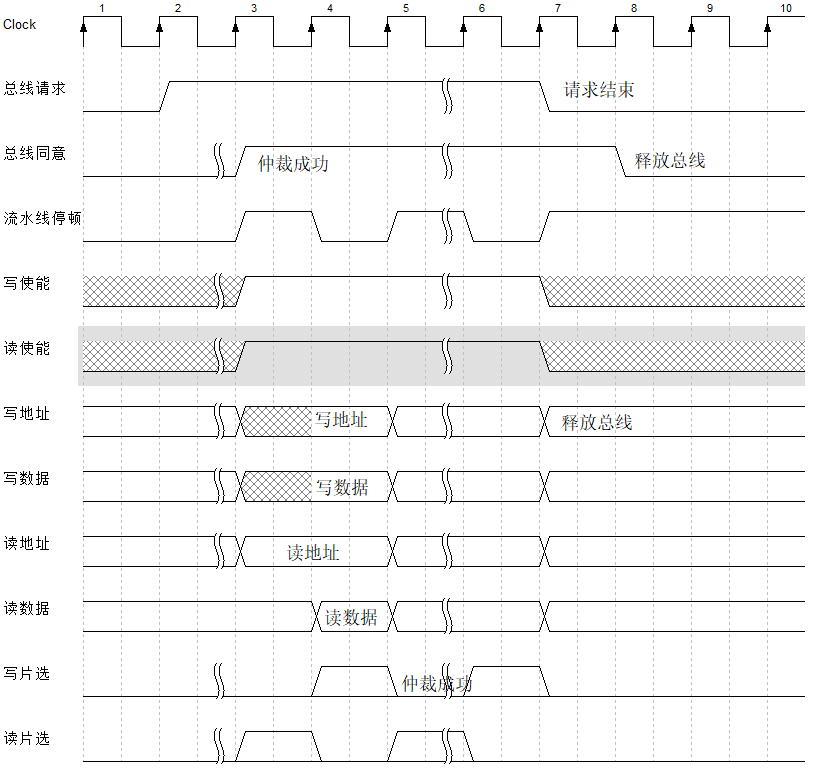

# XT_RISC-V 微控制器

个人学习作品。

一个极其简易的RV32I指令集单核MCU，几乎所有用户级与特权级(部分指令例如内存屏障暂不支持)支持，仅运行机器模式。

1. [RTL](RTL)包含了所有Verilog代码
2. [C_lib](C_lib)包含了本MCU的C语言库文件，包括寄存器定义、启动文件等
3. [Tools](Tools)有c语言编译工具，编译脚本
4. [Tests](tests)包含了测试用的C语言代码，同时也是编译脚本默认寻找**源文件**的位置

顶层文件在[这里](RTL\SOC\XT_Soc_Risc_V.sv)

PLL等IP核适用于**LCMXO2-4000HC-4MG132C**FPGA器件，IP核仅包含`ipx`和`lpc`文件，请使用开发工具重新生成。
外设也基本是围绕[该FPGA](https://www.latticesemi.com/zh-CN/Products/DevelopmentBoardsAndKits/STEPMXO2Dev.aspx)设计的，但是处理器内核可以很方便移植到其他FPGA上。

架构图

内存地址映射

## 异常/中断控制器

不支持中断嵌套，由于只有一个核心，不支持软件中断。

### 外部中断控制器

1. 支持最多32条外部中断
2. 中断具有优先级，0号中断优先级最高
3. 不直接处理中断清零，通过读写外设寄存器清零

## XT高速总线

从总线扇出的部分通常只有一条数据，然后输出到多个模块。

每次访问称为访问帧，访问帧有三种模式：RO，WO，RAW(读后写)
读数据时会强制流水线停顿一周期。

主机可以在帧后结束请求，结束请求后下一个上升沿才会释放总线。
一个访问帧最短2个时钟周期。
读数据始终比读地址慢一个时钟周期。从机必须在读使能的下一个周期内锁存数据，或锁存地址信息，通过MUX在下一个周期保持数据。
占用总线期间允许在帧间切换读写模式。

### 内核等待机制

在EX阶段访存需要流水线停顿。如果访问其他总线，则停顿周期会更长。XT_HB接收其他总线的finish信号，从机一帧可以发送两次finish(读与写的)，接收到finish后会切换读写阶段。

## XT低速总线

使用最简单的设计，半双工通信。若读写同时发生，先写后读。
有2个控制信号量：读取，写入。总线保证控制信号一定互斥。

使用时钟域跨越的设计

从机必须在读使能时读取数据，并保证在下一个时钟沿到来前保持稳定，从机读取时不经过输出寄存器。
从机在非读取时（读取为0时）必须输出全0数据，总线通过对所有从机的读数据进行或运算得到总体读数据（不使用MUX的结构）。
总线状态机在锁存状态时锁定总体读数据然后反馈给高速总线。

## 地址映射或选择

在外设端进行地址选择，使用向下比较的方法比较最高可用地址，然后匹配最短低位全地址。

## BOOTLOADER

自举加载流程：

1. 初始化加载ROM中的Bootloader程序
2. 把FLASH中的数据逐个拷贝到指令存储器RAM中
3. 指令地址跳转到0
4. 触发脉冲将MUX切换到指令存储器RAM

## TODO_LIST

- [ ] 尝试实现RV32C混合执行，把RV32C解码成RV32I指令
