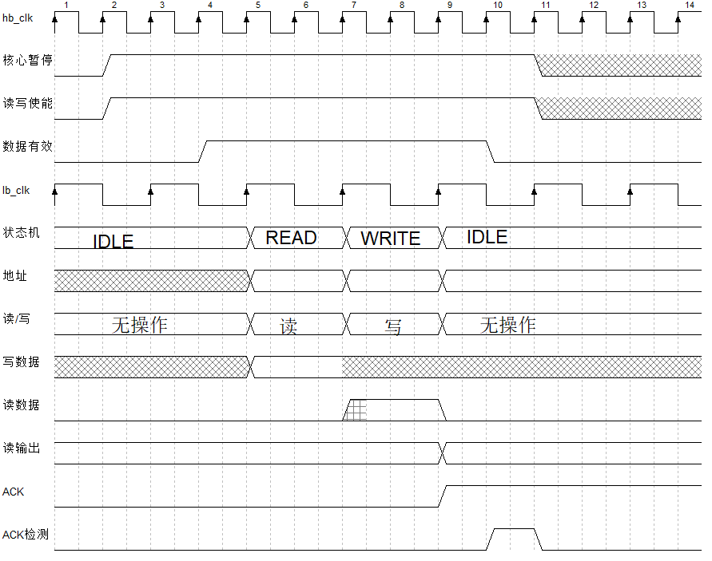
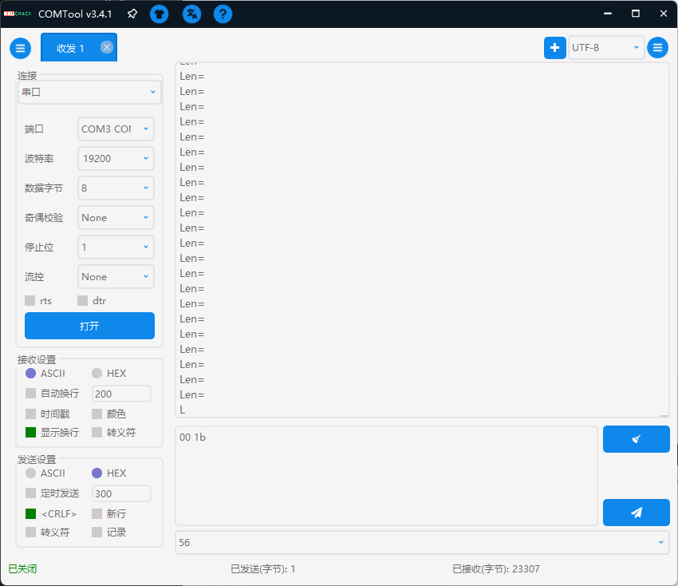

# XT_RISC-V 微控制器

**个人学习作品**，适合初学者食用。

一个极其简易的`RV32I_zicsr`指令集**单核MCU**，几乎所有用户级与特权级指令支持，仅运行机器模式。

1. [RTL](RTL)包含了所有Verilog代码，顶层文件在[这里](RTL\SOC\XT_Soc_Risc_V.sv)
2. [C_lib](C_lib)包含了本MCU的C语言库文件，包括寄存器定义、启动文件等
3. [Tools](Tools)有c语言编译工具，编译脚本
4. [Tests](tests)包含了测试用的C语言代码，同时也是编译脚本默认寻找**源文件**的位置

PLL等IP核适用于**LCMXO2-4000HC-4MG132C**FPGA器件，IP核仅包含`ipx`和`lpc`文件，请使用开发工具重新生成`verilog`文件。外设基本是围绕[该核心板](https://www.latticesemi.com/zh-CN/Products/DevelopmentBoardsAndKits/STEPMXO2Dev.aspx)设计的，但是处理器内核可以很方便移植到其他FPGA上。

[一致性测试](compliance_test/dev/Readme.md)

## 目录

- [XT\_RISC-V 微控制器](#xt_risc-v-微控制器)
  - [目录](#目录)
  - [MCU特性](#mcu特性)
    - [RV32I内核](#rv32i内核)
      - [异常/中断控制器](#异常中断控制器)
    - [时钟树](#时钟树)
    - [其他核心模块](#其他核心模块)
      - [外部中断控制器](#外部中断控制器)
      - [MTime和Mtimecmp(机器计时器)](#mtime和mtimecmp机器计时器)
  - [外设列表](#外设列表)
    - [系统外设](#系统外设)
    - [XT\_HB外设](#xt_hb外设)
    - [XT\_LB外设](#xt_lb外设)
    - [WISHBONE总线外设](#wishbone总线外设)
  - [XT高速总线](#xt高速总线)
    - [MMIO](#mmio)
    - [内核等待机制](#内核等待机制)
    - [读的副效应问题](#读的副效应问题)
    - [同时读写问题](#同时读写问题)
  - [XT低速总线](#xt低速总线)
  - [BOOTLOADER](#bootloader)
    - [编译工具链](#编译工具链)
    - [程序下载](#程序下载)
  - [引脚与GPIO](#引脚与gpio)
  - [TODO\_LIST](#todo_list)

## MCU特性

架构图

内存地址映射

### RV32I内核

- 三级流水线，取指、译码、执行
- 不支持JTAG和DEBUG
- 屏障指令空实现(等效NOP)
- ECALL、EBREAK指令跳转异常
- WFI指令暂停流水线

#### 异常/中断控制器

- 不支持中断嵌套
- 外部中断有一个控制器
- 支持定时器中断
- 支持软件中断

### 时钟树

时钟频率可根据实际情况修改。

- 内部振荡器频率**2.15MHz**，作为时钟监视器的独立时钟源
- 时钟监视器监控PLL状态，若出现脱锁将自动重置PLL并发出全局`RST`信号
- 时钟监视器可设置上电等待时间、PLL锁定等待时间，拥有一个外部重置源，通过按钮可重置系统
- PLL输入时钟频率**12MHz**
- 核心、高速总线、WISHBONE总线位于同一时钟域，基准频率**12MHz**
- 机器计时器固定频率**1MHz**
- UART采样频率**153.846KHz**，超采样率为**8**时**波特率19200误差0.16%**
- 低速总线频率**100KHz**

### 其他核心模块

#### 外部中断控制器

- 支持最多32条外部中断
- 中断具有优先级，0号中断优先级最高
- 不直接处理中断清零，通过读写外设寄存器清零

#### MTime和Mtimecmp(机器计时器)

- 无跨时钟域时序惩罚
- 硬件不处理非原子读取一致性问题，通过软件处理

## 外设列表

### 系统外设

1. Bootloader控制器
2. 外部中断控制器
3. 64bit机器计时器
4. UART通信接口

### XT_HB外设

### XT_LB外设

1. 开关(3)与按钮(4)
2. 8位LED灯
3. 硬件解码7段LED数码管X2
4. 32个功能复用GPIO

### WISHBONE总线外设

该总线的外设为EFB硬核

1. 左PLL动态配置 **TODO**
2. 右PLL动态配置 **TODO**
3. 1号I2C接口
4. 2号I2C接口
5. SPI接口
6. 16bit定时器/计数器
7. 程序存储Flash

## XT高速总线

XT_HB是内核访问外部数据必经的通道，承担内存地址映射、互联其他总线的职责。

- 从总线扇出的部分通常只有一条数据，然后输出到多个模块。
- 主设备每次访问称为访问帧，访问帧有三种模式：RO，WO，RW(同时读写)，访问帧过程中信号必须保持稳定，访问帧不可分割，必须等待该访问帧结束才能进入下一访问帧。
- 如果对同一个从设备同时读写，从设备自行决定读取旧数据还是通过旁路读取写入数据。(通常是读取旧数据)
- 读与写独立，如果两个主设备读写不冲突，可以同时进行，读写使能信号本身就是总线请求信号。

主机可以在每帧结束后停止总线访问、切换读写模式。

仲裁器使用轮询仲裁器。

读写仲裁是独立的，当两个主机已经分别独占了读写资源时，如果同时请求对方的读写资源，这会产生死锁，将重置读写轮询索引到0，保证下次将读写资源仲裁给同一个主机。

### MMIO

一个完整访问地址由两部分组成：高位的设备**识别符**，低位的**偏移量**。识别符占用位数是参数配置的，决定了最多能区分多少设备。偏移量占用位数构成固定大小寻址空间。

每个设备至少占用一个识别符，可以**连续**占用多个，占用的第一个识别符是**基准识别符**。**基准识别符**与全0偏移量拼接为设备的**基地址**，**基地址**必须在识别符上对齐。

- 如果设备只占用一个识别符，可以直接使用偏移量作为访问地址。
- 如果设备**连续**占用多个识别符，偏移量寻址空间不足，使用完整地址的**识别符**部分减去**基准识别符**，再与偏移量拼接得到访问地址。

完整地址示例：

| 设备识别符 | 偏移量        | 说明     |
| ---------- | ------------- | -------- |
| 001        | 0000000000000 | 基地址/访问地址   |
| 101        | 0000000000000 | 基地址/访问地址   |
| 101        | 0000011100001 | 访问地址 |

设备也可以是其他总线，其他总线可以看作是一个抽象的**地址域**，XT_HB只与各个抽象的设备(地址域)进行数据交换，其他总线内部自行控制从设备。

为避免挂载在XT_HB上的外设浪费识别符，这些设备不直接挂载到XT_HB而是连接到XT_HB本地地址域XT_HB_Domain模块上。本地地址域只占用一个识别符。这些外设的地址都是字对齐的。

同时还有一个系统外设SystemPeripheral模块，用于连接与系统强相关的外设，比如内存映射CSR、外部中断控制器。这些外设的地址也都是字对齐的，也使用识别符加偏移量的方式。

### 内核等待机制

在EX阶段访存需要流水线停顿。如果访问其他总线，则停顿周期会更长。XT_HB接收其他总线的finish信号，总线一帧只需要发送一次finish。

### 读的副效应问题

由于读使能作用多个周期，可能对读的副效应产生影响，当从设备的ACK响应之后，才完成一次读写，此时副效应应该只发生一次，从设备自行处理。

在XT_HB本地域中的外设，因为时序要求严格，在读地址有效的下一个周期必须输出数据，本地域控制器会在数据有效周期主动拉低读使能。

### 同时读写问题

1. 如果主设备M同时对两个从设备A、B分别读写，如果A的ACK只保持了一个周期，并且此时M因为B没有完成操作而在等待ACK，则有可能会错过A的ACK。
2. 主设备M同时对单个从设备读写，当读写ACK不同步时，主机也可能会错过ACK。在所有操作完成后再ACK可以避免，如果是两个不同的主设备读写，他们都需要等待统一ACK，效率较低。

可以使用一个信号来表示主机收到ACK，来进行双向确认。

当然，RISC-V同时读写的原子指令只是对同一个地址、同一个设备读写，所以**问题1**对于内核并**不存在**。对于**问题2**可以用一个信号表示总线独占状态来更快的解决。

## XT低速总线

使用最简单的设计，半双工通信。若读写同时发生，先读后写。
有2个控制信号量：读取，写入。总线保证控制信号一定互斥。

使用时钟域跨越的设计

从机必须在读使能时读取数据，并保证在下一个时钟沿到来前保持稳定，从机读取时不经过输出寄存器。
从机在非读取时（读取为0时）必须输出全0数据，总线通过对所有从机的读数据进行或运算得到总体读数据（不使用MUX的结构）。
总线状态机在锁存状态时锁定总体读数据然后反馈给高速总线。

## BOOTLOADER

自举加载流程：

1. 初始化加载ROM中的Bootloader程序
2. 把FLASH中的数据逐个拷贝到指令存储器RAM中
3. 指令地址跳转到0
4. 触发脉冲将MUX切换到指令存储器RAM

### 编译工具链

[SiFive riscv64-unknown-elf-gcc-8.3.0](https://github.com/sifive/freedom-tools/releases/tag/v2020.04.0-Toolchain.Only)已停止更新但**程序尺寸最小**，自举启动由此编译

[riscv-none-elf-gcc-xpack](https://github.com/xpack-dev-tools/riscv-none-elf-gcc-xpack)标准最新，默认情况下**推荐使用**

### 程序下载

`1页 == 16字节`
`1 page == 16 byte`

最大页数由Flash决定，当前器件为767

综合前请使用[初始化文件](RTL/mem_files)重新生成`rom_boot`与`rom_str`IP核

1. 将下载开关(拨码开关1)拨动到高电平位置
2. 连接电脑并打开串口程序
3. 选择下载操作；**操作提示：*下载:0x56,启动:0xF1***
4. 发送程序的页数(共两字节，先高位)；**操作提示：*Len=***
5. 确认开始下载；**操作提示：*开始:0x78***
6. 发送程序二进制文件（确保已经补零对齐到页长度）
7. 确认下载完成；**操作提示：*完成:0x57***
8. 启动程序；**操作提示：*下载:0x56,启动:0xF1***

## 引脚与GPIO

引脚图来源于[该核心板](https://www.latticesemi.com/zh-CN/Products/DevelopmentBoardsAndKits/STEPMXO2Dev.aspx)

每个功能可以选中某一个GPIO进行功能复用

| GPIO        | 输入复用功能          | 输出复用功能       |
| ----------- | --------------------- | ------------------ |
| GPIO[7:0]   | 定时器重置/定时器输入 | -                  |
| GPIO[28:21] | -                     | SPI CS2/定时器输出 |
| 其他        | -                     | -                  |

## TODO_LIST

- [ ] 其他异常处理函数
- [x] 修改XT_HB的时序，适配单周期原子读写的外设
- [ ] 用一个小型控制器来加载Flash，而不是ROM，ROM太占用资源了
- [x] 系统外设整合到一个模块中
- [ ] 把总线不同位宽寄存器划分到一起，是否能更加节省资源？
- [ ] DMA控制器
- [ ] 尝试实现RV32C混合执行，把RV32C解码成RV32I指令
- [ ] 调试器支持
- [ ] FreeRTOS支持
- [ ] Rust重写外设标准库
- [ ] 跑分(低端设备没必要吧)
